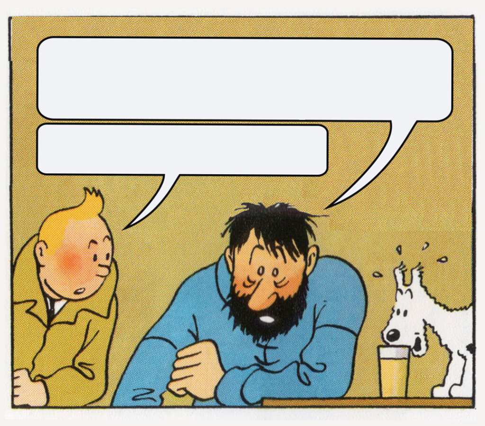

# WHAT A... meme, huh?




### <u>What is it</u>
Fun little project that generates text for speech bubbles. 

An interactive version of  [this meme](https://knowyourmeme.com/memes/what-a-week-huh).

Always based on current date. 

Little node app that generates image on canvas and serves it as png file.

### <u>The stack</u>

* NodeJS / express
* canvas (node-canvas)

### <u>Setup</u>

```
> yarn
> npm start 
or
> npm run dev
```

### <u>Endpoints</u>
It's probably pretty self-explanatory when looking at the code, but endpoints are:

```
/century
/fullyear
/year
/year
/month
/week
/day 
```
Root path `/` will point randomly to one of these above.

### <u>Live preview</u>
see it live at <a href="https://what-a-year.onrender.com/fullyear" target="_blank">https://what-a-year.onrender.com/</a>